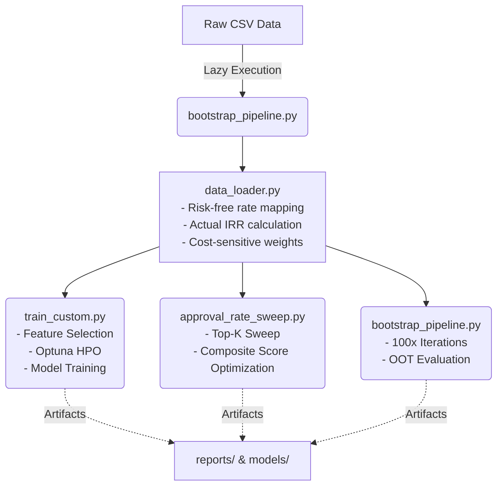

# 📘 P2P Lending Portfolio Optimization: A Cost-Sensitive Machine Learning Approach

본 프로젝트는 Lending Club P2P 대출 데이터(2007~2020)를 활용하여, 단순한 부도 예측(Classification)을 넘어 **실제 투자자의 위험 조정 수익률(Risk-Adjusted Return)을 극대화**하기 위한 포트폴리오 최적화 파이프라인입니다. 

금융 데이터의 비대칭적 손실 구조를 반영한 **비용 민감 학습(Cost-sensitive Learning)**과 미래 시장에 대한 **OOT(Out-of-Time) 몬테카를로 시뮬레이션**을 통해 모형의 강건성과 실무적 효용성을 입증합니다.

---

## 🚀 Project Highlights

- **Goal:** 부도 예측 정확도가 아닌 **투자 포트폴리오 성과(Sharpe Ratio 및 IRR)** 최적화
- **Algorithms:** XGBoost, LightGBM, CatBoost 및 Soft Voting 앙상블 기법 적용
- **Cost-sensitive Learning:** 대출 금액 규모(Log-scale) 및 부도 패널티를 결합한 샘플 가중치(`sample_weight`) 산출 및 통제
- **Evaluation Design:** - **OOT(Out-of-Time) Test:** 시계열 기준 가장 최근 20% 데이터를 완벽히 분리하여 미래 시장 모사
  - **Bootstrap Simulation:** 과거 80% 데이터 내에서 100회의 층화 무작위 추출(Stratified Split) 재학습을 통한 모형 강건성(Robustness) 검증
- **Decision Unit:** 단순 확률 임계값이 아닌 **최적 승인률(Top-K)** 기반의 포트폴리오 편입 의사결정

---

## 🏗 Pipeline Architecture



# 📂 Directory Structure

Lending-Club-PRJ/
├── data/
│   ├── processed/                  # 전처리 완료 Parquet 데이터
│   └── external/                   # 거시경제 지표 (GS3, GS5 국채금리)
├── models/                         # 학습 완료 모델 아티팩트 (.pkl, .cbm 등)
├── reports/
│   ├── feature_importance/         # 트리 분기 기준 Top-N 변수 산출 결과
│   ├── figures/                    # 몬테카를로 시뮬레이션 성과 분포 시각화
│   └── approval_sweep/             # 승인 임계값 최적화 결과 및 리포트
├── src/
│   ├── config.py                   # 전역 경로, 하이퍼파라미터 및 스위치 관리
│   ├── preprocess_pipeline.py      # Polars 기반 데이터 전처리 및 누수 차단
│   ├── data_loader.py              # IRR 등가연금 근사 및 훈련 가중치 부여
│   ├── train_custom.py             # Optuna 베이지안 최적화 및 메인 학습
│   ├── bootstrap_pipeline.py       # OOT 시계열 분할 및 강건성 평가 시뮬레이션
│   └── approval_rate_sweep.py      # 수익성(ROI)과 안정성(Sharpe) 기반 임계값 탐색
├── requirements.txt
└── README.md


# 🏃 How to Run (테스트 및 실행 가이드)

본 프로젝트는 독립적인 실행 환경 구축을 위해 파이썬 가상환경(Virtual Environment) 사용을 권장합니다. 터미널(Mac/Linux) 또는 명령 프롬프트(Windows)에서 프로젝트 최상위 폴더(`Lending-Club-PRJ`)로 이동한 후 아래 명령어를 순차적으로 실행해 주십시오.

### 1. 가상환경 생성 및 활성화
```bash
# 가상환경 생성 (폴더명: venv)
python -m venv venv

# 가상환경 활성화 (OS에 맞게 선택)
# [Mac / Linux 사용자]
source venv/bin/activate

# [Windows 사용자]
.\venv\Scripts\activate
```
### 2. 필수 패키지 설치
가상환경이 활성화된 상태(터미널 명령어 입력줄 앞에 (venv) 표시 확인)에서 필요한 라이브러리를 설치합니다.

```bash
# pip 업데이트 및 패키지 설치
pip install --upgrade pip
pip install -r requirements.txt
```

### 3. 파이프라인 순차 실행
데이터 전처리부터 최종 시뮬레이션까지 아래 순서대로 실행하시면 전체 분석 결과가 reports/ 폴더 내에 자동 생성됩니다.

```bash
# Step 1. 데이터 파이프라인 가동 (Polars Streaming 전처리 및 가중치 산출)
python src/preprocess_pipeline.py

# Step 2. 모델 최적화 및 중요 변수 추출 (Optuna 베이지안 튜닝)
python src/train_custom.py

# Step 3. 최적 승인 임계값 탐색 (수익성 및 안정성 기반 Composite Score 도출)
python src/approval_rate_sweep.py

# Step 4. 최종 모형 시뮬레이션 및 평가 보고서 생성 (100회 부트스트랩 검증)
python src/bootstrap_pipeline.py
```

